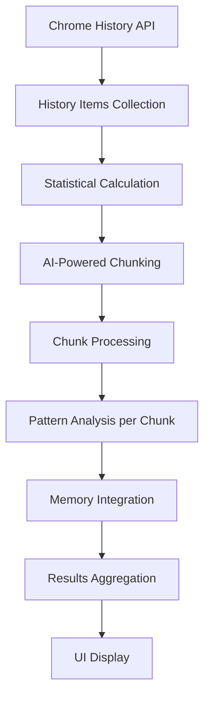

# History Workflow Analyzer - Architecture Documentation

## Overview

The **History Workflow Analyzer** is a Chrome browser extension that analyzes browsing history to identify repetitive workflows and behavioral patterns. It uses a dual AI provider model, supporting both Chrome's built-in AI for local processing and remote AI providers for more powerful analysis.

## Tech Stack

- **Frontend Framework**: Svelte 5 with TypeScript
- **Build Tools**: Vite for development and building
- **Testing**: Vitest with Testing Library
- **Styling**: Tailwind CSS 4
- **Linting**: Biome for code formatting and quality
- **Package Manager**: pnpm

## Architecture Components

### 1. Chrome Extension Structure

The extension follows Chrome's Manifest V3 specification:

```
├── manifest.json          # Extension configuration and permissions
├── background.ts           # Service worker for extension lifecycle
├── sidepanel.html         # HTML shell for the side panel UI
├── content-scripts/       # Scripts for interacting with web pages
└── src/                   # Application source code
```

**Key Permissions:**
- `history`: Access to Chrome browsing history
- `storage` & `unlimitedStorage`: Local data persistence for settings and memory.
- `sidePanel`: Side panel UI integration.
- `activeTab`: For context injection on supported sites.
- `alarms` & `notifications`: For ambient background analysis.

### 2. Core Application (`src/`)

#### Main Application Files
- **`App.svelte`** - Main UI component orchestrating the entire workflow
- **`sidepanel.ts`** - Entry point that mounts the Svelte application
- **`types.ts`** - TypeScript interfaces for data structures

#### Component Library (`src/lib/`)
- **`HistoryFetcher.svelte`** - Handles Chrome history API interactions
- **`AnalysisProgress.svelte`** - Real-time progress tracking UI
- **`AnalysisResults.svelte`** - Display analysis results and insights
- **`AIProviderStatus.svelte`** - Shows AI provider availability and status
- **`AdvancedSettings.svelte`** - Configuration for AI providers, prompts, and ambient analysis.
- **`ContextSelector.svelte`** - UI for the context injection feature.

#### Utility Modules (`src/utils/`)

**Core Analysis Engine:**
- **`analyzer.ts`** - Main analysis orchestration with chunking and AI integration
- **`ai-provider-factory.ts`** - Factory for creating AI provider instances (local or remote).
- **`chrome-ai.ts`** - Wrapper for Chrome's built-in AI Language Model API.
- **`remote-ai.ts`** - Wrapper for remote AI APIs (e.g., Anthropic Claude).
- **`chunking.ts`** - Intelligent time-based data segmentation.

**Supporting Utilities:**
- **`memory.ts`** - Persistent storage for analysis state and accumulated insights.
- **`constants.ts`** - AI prompts and configuration constants.
- **`schemas.ts`** - JSON Schema validation for AI responses.
- **`simple-context-matcher.ts`** - Logic for matching user input to stored memory for context injection.

### 3. Data Flow Architecture

#### Analysis Pipeline



### 4. AI Integration Architecture

The extension supports two types of AI providers, configured via a factory pattern (`ai-provider-factory.ts`).

#### 4.1. Chrome AI (Local)
- **Local Processing**: Uses Chrome's built-in Language Model API (no external API calls).
- **Privacy-First**: All data processing happens locally in the browser.
- **Token Management**: Automatic chunking to stay within Chrome AI's token limits.
- **Retry Logic**: Exponential backoff for quota-exceeded scenarios.

#### 4.2. Remote AI (e.g., Anthropic Claude)
- **Remote Processing**: Sends browsing history to a third-party API.
- **User Consent**: Requires explicit user configuration and API key entry.
- **Flexibility**: Allows for more powerful models at the cost of privacy.

### 5. Memory and Persistence

#### Memory System (`memory.ts`)
- **Incremental Learning**: Accumulates insights across analysis sessions.
- **Pattern Evolution**: Existing patterns refined with new data.
- **User Profile Building**: Continuous enhancement of user behavior understanding.
- **Chrome Storage API**: Persistent local storage using `chrome.storage.local`.

### 6. Context Injection on AI Chat Platforms

A key feature of the extension is its ability to inject context into popular AI chat websites (like ChatGPT and Claude).

#### 6.1. Content Script (`content-scripts/universal-context.ts`)
- **Platform Detection**: Identifies the chat platform (e.g., ChatGPT, Claude) based on the hostname.
- **DOM Injection**: Dynamically injects a "Context" button into the chat interface using platform-specific selectors.
- **Input Monitoring**: Listens to the user's input in the chat box.

#### 6.2. Context Matching (`utils/simple-context-matcher.ts`)
- **Memory Access**: Retrieves the user's profile and workflow patterns from `chrome.storage.local`.
- **String Similarity**: As the user types, it uses a simple string similarity algorithm (Dice's Coefficient) to find relevant context from memory.
- **Suggestion UI**: Displays relevant suggestions in a dropdown panel, allowing the user to insert them into their prompt.

#### 6.3. User Experience
1.  **Button Appears**: A "Context" button is added to the chat UI.
2.  **User Types**: The script analyzes the input text.
3.  **Suggestions Offered**: If relevant context is found, the button becomes active. Clicking it reveals suggestions.
4.  **User Inserts**: The user can click a suggestion to add it to their prompt, or shift-click the button to insert a structured summary of their profile.

### 7. Error Handling and Resilience

- **Chunking Fallbacks**: If AI-based chunking fails, it falls back to a simpler time-based method.
- **Token Limit Management**: Intelligently subdivides data to fit within model context windows.
- **Graceful Degradation**: The system can continue processing even if parts of the analysis fail.

### 8. Security and Privacy

- **Local by Default**: The primary analysis mode is fully local.
- **Explicit Consent**: Remote AI usage requires explicit user action.
- **Parameter Filtering**: Tracking parameters are filtered from URLs to reduce data leakage.
- **Manifest V3**: Adheres to modern, stricter security standards.

## Development and Testing

- **Development**: `pnpm dev` - Vite development server with hot reload.
- **Production**: `pnpm build` - Optimized extension bundle.
- **Quality Assurance**: `pnpm check` - Comprehensive linting, type checking, and testing.
