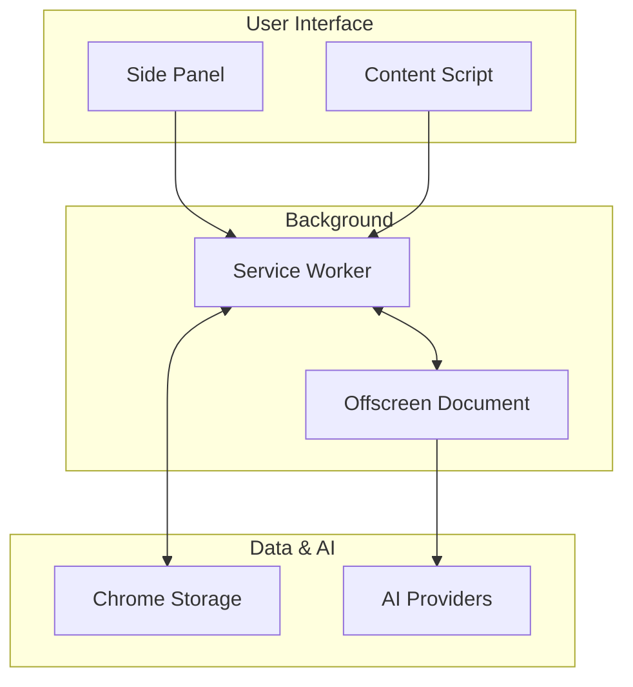

# Squash History Workflow Analyzer - Architecture Documentation

## Overview

The **History Workflow Analyzer** is a Chrome browser extension that analyzes browsing history to identify repetitive workflows and behavioral patterns. It uses a dual AI provider model, supporting both Chrome's built-in AI for local processing and remote AI providers for more powerful analysis.

### High-Level Diagram

```text
+---------------------------------------------------------------------------------+
| User Interface                |
| ----------------------------- |
| Side Panel UI (Svelte)        | Content Script (on AI Chat sites)          |
| (Initiates analysis, displays | (Injects context button, reads user input) |
| results, manages settings)    |                                            |
| +-----------------            | --------------------------------------     | ------------------------+ |
| (User Actions)                | (Context Request)                          |
                  v                                      v
+---------------------------------------------------------------------------------+
| Service Worker (background.ts)                           |
| -------------------------------------------------------- |
| - Manages extension lifecycle & UI events.               |
| - Handles alarms for ambient analysis.                   |
| - Launches and communicates with the Offscreen Document. |
| - Relays progress and results to the UI.                 |
| - Acts as a proxy for Chrome Storage access.             |
| +-----------------                                       | --------------------------^-----------    | ------------------------+               |
| (Start Analysis)                                         | (R/W Memory)                              | (Read Memory)                           |
| v                                                        | v                                         |
| +----------------------------------+                     | +---------------------------------------+ |
| Offscreen Document                                       |                                           |                                         | Chrome Storage API |
| (offscreen.ts)                                           | ---------+                                | --------------------------------------- |
| ----------------------------------                       |                                           | - Stores analysis memory (patterns,     |
| - Performs heavy lifting:                                |                                           | user profile).                          |
| - Fetches history                                        |                                           | - Persists user settings.               |
| - Chunks data                                            | +---------------------------------------+ |
| - Manages AI sessions                                    |
| - Merges results into memory                             |
| +----------------                                        | -----------------+                        |
| (AI API Calls)                                           |
                 v
+----------------------------------+
| AI Providers                   |
| ------------------------------ |
| - Chrome AI (Local, on-device) |
| - Claude API (Remote)          |
+----------------------------------+
```

## Tech Stack

- **Frontend Framework**: Svelte 5 with TypeScript
- **Build Tools**: Vite for development and building
- **Testing**: Vitest with Testing Library
- **Styling**: Tailwind CSS 4
- **Linting**: Biome for code formatting and quality
- **Package Manager**: pnpm

## Architecture Components

### 1. Chrome Extension Structure

The extension follows Chrome's Manifest V3 specification:

```
├── manifest.json          # Extension configuration and permissions
├── background.ts           # Service worker for extension lifecycle
├── sidepanel.html         # HTML shell for the side panel UI
├── offscreen.html         # HTML for the offscreen document
├── offscreen.ts           # Logic for the offscreen document
├── content-scripts/       # Scripts for interacting with web pages
└── src/                   # Application source code
```

**Key Permissions:**
- `history`: Access to Chrome browsing history
- `storage`: Local data persistence for settings and memory.
- `sidePanel`: Side panel UI integration.
- `activeTab`: For context injection on supported sites.
- `alarms` & `notifications`: For ambient background analysis.
- `offscreen`: To run analysis in a separate, non-visible document.

### 2. Core Application (`src/`)

#### Main Application Files
- **`App.svelte`** - Main UI component orchestrating the entire workflow
- **`sidepanel.ts`** - Entry point that mounts the Svelte application
- **`types.ts`** - TypeScript interfaces for data structures


### 3. Data Flow Architecture

The analysis pipeline is designed to be robust and resilient, running entirely within a dedicated offscreen document to prevent the main service worker from being terminated during long-running tasks.



### 4. AI Integration Architecture

The extension supports two types of AI providers through a unified architecture, configured via a factory pattern (`ai-provider-factory.ts`). The AI analysis is performed within the offscreen document, which communicates with the selected AI provider.

#### 4.1. Unified Provider Architecture
- **Factory Pattern**: All AI providers are managed through `ai-provider-factory.ts` with singleton instances
- **Consistent Interface**: Both Chrome AI and Claude implement the same `AIProvider` interface
- **Unified Message Flow**: 
  1. Side panel sends `ai:initialize` to background service worker
  2. Background forwards to offscreen document as `offscreen:initialize-ai`
  3. Offscreen document uses factory to get/create provider instance
  4. Provider initialization and status updates flow back through `offscreen:ai-status`
- **No Special Cases**: Chrome AI and Claude follow identical initialization and communication patterns

**Provider Selection Flow:**
1. User selects AI provider in Advanced Settings (side panel)
2. Configuration is saved to Chrome storage
3. When analysis starts, the offscreen document loads the configuration
4. The factory provides the appropriate provider instance (creating if needed)
5. Both providers persist as singletons in the offscreen document

#### 4.2. Chrome AI (Local)
- **Local Processing**: Uses Chrome's built-in Language Model API (no external API calls)
- **Privacy-First**: All data processing happens locally in the browser
- **Token Management**: Automatic chunking to stay within Chrome AI's token limits
- **Retry Logic**: Exponential backoff for quota-exceeded scenarios
- **Model Requirements**: Chrome AI requires the Gemini Nano model (~4GB) to be downloaded via Chrome's components page (chrome://components)

#### 4.3. Remote AI (e.g., Anthropic Claude)
- **Remote Processing**: The offscreen document sends browsing history to a third-party API
- **User Consent**: Requires explicit user configuration and API key entry
- **Flexibility**: Allows for more powerful models at the cost of privacy

### 5. Memory and Persistence

#### Memory System (`memory.ts`)
- **Incremental Learning**: Accumulates insights across analysis sessions.
- **Pattern Evolution**: Existing patterns refined with new data.
- **User Profile Building**: Continuous enhancement of user behavior understanding.
- **Chrome Storage API**: Persistent local storage using `chrome.storage.local`.

### 6. Context Injection on AI Chat Platforms

A key feature of the extension is its ability to inject context into popular AI chat websites (like ChatGPT and Claude).

#### 6.1. Content Script (`content-scripts/universal-context.ts`)
- **Platform Detection**: Identifies the chat platform (e.g., ChatGPT, Claude) based on the hostname.
- **DOM Injection**: Dynamically injects a "Context" button into the chat interface using platform-specific selectors.
- **Input Monitoring**: Listens to the user's input in the chat box.

#### 6.2. Context Matching (`utils/simple-context-matcher.ts`)
- **Memory Access**: Retrieves the user's profile and workflow patterns from `chrome.storage.local`.
- **String Similarity**: As the user types, it uses a simple string similarity algorithm (Dice's Coefficient) to find relevant context from memory.
- **Suggestion UI**: Displays relevant suggestions in a dropdown panel, allowing the user to insert them into their prompt.

### 7. Error Handling and Resilience

- **Chunking Fallbacks**: If AI-based chunking fails, it falls back to a simpler time-based method.
- **Token Limit Management**: Intelligently subdivides data to fit within model context windows.
- **Graceful Degradation**: The system can continue processing even if parts of the analysis fail.

### 8. Security and Privacy

- **Local by Default**: The primary analysis mode is fully local.
- **Explicit Consent**: Remote AI usage requires explicit user action.
- **Parameter Filtering**: Tracking parameters are filtered from URLs to reduce data leakage.
- **Manifest V3**: Adheres to modern, stricter security standards.

## Development and Testing

- **Development**: `pnpm dev` - Vite development server with hot reload.
- **Production**: `pnpm build` - Optimized extension bundle.
- **Quality Assurance**: `pnpm check` - Comprehensive linting, type checking, and testing.
