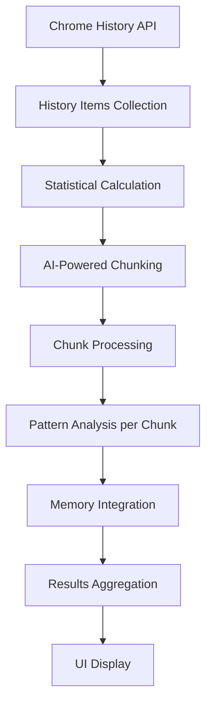

# History Workflow Analyzer - Architecture Documentation

## Overview

The **History Workflow Analyzer** is a Chrome browser extension that analyzes browsing history to identify repetitive workflows and behavioral patterns. It uses Chrome's built-in AI Language Model API to provide intelligent analysis without sending data to external servers.

## Tech Stack

- **Frontend Framework**: Svelte 5 with TypeScript
- **Build Tools**: Vite for development and building
- **Testing**: Vitest with Testing Library
- **Styling**: Tailwind CSS 4
- **Linting**: Biome for code formatting and quality
- **Package Manager**: pnpm

## Architecture Components

### 1. Chrome Extension Structure

The extension follows Chrome's Manifest V3 specification:

```
├── manifest.json          # Extension configuration and permissions
├── background.js           # Service worker for extension lifecycle
├── sidepanel.html         # HTML shell for the side panel UI
└── src/                   # Application source code
```

**Key Permissions:**
- `history`: Access to Chrome browsing history
- `storage`: Local data persistence
- `sidePanel`: Side panel UI integration

### 2. Core Application (`src/`)

#### Main Application Files
- **`App.svelte`** - Main UI component orchestrating the entire workflow
- **`sidepanel.ts`** - Entry point that mounts the Svelte application
- **`types.ts`** - TypeScript interfaces for data structures

#### Component Library (`src/lib/`)
- **`HistoryFetcher.svelte`** - Handles Chrome history API interactions
- **`AnalysisProgress.svelte`** - Real-time progress tracking UI
- **`AnalysisResults.svelte`** - Display analysis results and insights
- **`ChromeAIStatus.svelte`** - Shows Chrome AI availability status
- **`AdvancedSettings.svelte`** - Custom prompt configuration
- **`ChunkDisplay.svelte`** - Debug view for data chunking
- **`ChunkDebugInfo.svelte`** - Detailed chunk analysis information

#### Utility Modules (`src/utils/`)

**Core Analysis Engine:**
- **`analyzer.ts`** - Main analysis orchestration with chunking and AI integration
- **`chrome-ai.ts`** - Chrome AI Language Model API wrapper
- **`chunking.ts`** - Intelligent time-based data segmentation

**Supporting Utilities:**
- **`memory.ts`** - Persistent storage for analysis state and accumulated insights
- **`constants.ts`** - AI prompts and configuration constants
- **`schemas.ts`** - JSON Schema validation for AI responses

### 3. Data Flow Architecture

#### Analysis Pipeline



#### Key Data Structures

**AnalysisResult Interface:**
```typescript
interface AnalysisResult {
  totalUrls: number;
  dateRange: { start: Date; end: Date };
  patterns: WorkflowPattern[];
  topDomains: { domain: string; count: number }[];
  userProfile: UserProfile;
  chunks?: ChunkInfo[];
}
```

**WorkflowPattern Interface:**
```typescript
interface WorkflowPattern {
  pattern: string;
  description: string;
  frequency: number;
  urls: string[];
  timePattern?: string;
  suggestion: string;
  automationPotential: "high" | "medium" | "low";
}
```

### 4. AI Integration Architecture

#### Chrome AI Integration
- **Local Processing**: Uses Chrome's built-in Language Model API (no external API calls)
- **Privacy-First**: All data processing happens locally in the browser
- **Token Management**: Automatic chunking to stay within Chrome AI's 1024 token limit
- **Retry Logic**: Exponential backoff for quota-exceeded scenarios

#### AI Processing Flow
1. **Chunking Phase**: AI identifies natural browsing sessions from timestamps
2. **Analysis Phase**: Each chunk analyzed for patterns and user behavior
3. **Memory Integration**: New patterns merged with existing knowledge
4. **Result Synthesis**: Comprehensive user profile and workflow patterns

### 5. Memory and Persistence

#### Memory System (`memory.ts`)
- **Incremental Learning**: Accumulates insights across analysis sessions
- **Pattern Evolution**: Existing patterns refined with new data
- **User Profile Building**: Continuous enhancement of user behavior understanding
- **Chrome Storage API**: Persistent local storage using Chrome's storage API

#### Memory Structure:
```typescript
interface AnalysisMemory {
  userProfile: UserProfile;
  patterns: WorkflowPattern[];
  lastAnalyzedDate: Date;
  totalItemsAnalyzed: number;
  version: number;
}
```

### 6. Error Handling and Resilience

#### Chunking Fallbacks
- **AI Chunking**: Primary method using Chrome AI for intelligent session detection
- **Half-Day Fallback**: Automatic fallback to time-based chunking (AM/PM periods)
- **Batch Processing**: Large datasets processed in manageable batches

#### Token Limit Management
- **Binary Search**: Optimal chunk size determination through Chrome AI token measurement
- **Subdivision**: Automatic chunk subdivision when token limits exceeded  
- **Privacy Protection**: URL parameter filtering to reduce token usage

#### Error Recovery
- **Graceful Degradation**: Continues processing remaining chunks if individual chunks fail
- **Retry Mechanisms**: Exponential backoff for quota and network errors
- **Partial Results**: Returns available results even with processing failures

### 7. Security and Privacy

#### Data Protection
- **Local Processing**: All analysis happens within the browser
- **Parameter Filtering**: Tracking parameters automatically hidden/removed
- **No External Transmission**: History data never leaves the user's device
- **Secure Storage**: Uses Chrome's secure storage APIs

#### Content Security
- **Manifest V3**: Modern security model with restricted permissions
- **Service Worker**: Secure background processing
- **Sandboxed Execution**: Extension runs in Chrome's security sandbox

### 8. Performance Considerations

#### Optimization Strategies
- **Chunked Processing**: Large datasets processed in manageable segments  
- **Progress Tracking**: Real-time progress updates with cancellation support
- **Memory Efficiency**: Streaming processing to minimize memory footprint
- **Caching**: Analysis results cached to avoid reprocessing

#### Scalability
- **Token-Aware Processing**: Automatic adjustment to Chrome AI limitations
- **Batch Processing**: Handles large history datasets efficiently
- **Incremental Analysis**: Builds on previous analysis results

## Development and Testing

### Build System
- **Development**: `pnpm dev` - Vite development server
- **Production**: `pnpm build` - Optimized extension bundle
- **Quality Assurance**: `pnpm check` - Comprehensive linting, type checking, and testing

### Testing Strategy
- **Unit Tests**: Core utility functions (`analyzer.test.ts`, `chunking.test.ts`)
- **Component Tests**: Svelte component testing with Testing Library
- **Integration Tests**: End-to-end analysis pipeline validation

### Code Quality
- **TypeScript**: Full type safety throughout the application
- **Biome**: Consistent code formatting and linting
- **Svelte Check**: Svelte-specific validation and type checking

## Extension Installation and Distribution

The extension is designed for Chrome browsers with Manifest V3 support and requires:
- Chrome version 138+ (for Chrome AI Language Model API)
- Side panel support
- History access permissions

This architecture provides a robust, privacy-focused solution for analyzing browsing patterns while leveraging Chrome's built-in AI capabilities for intelligent insights.