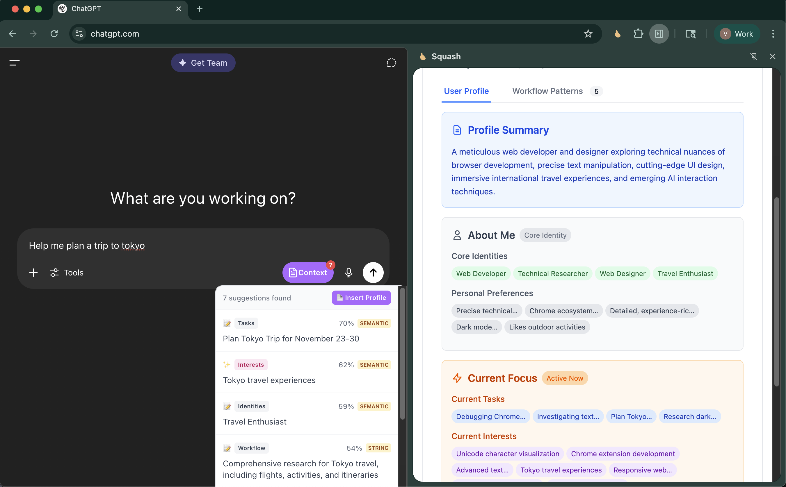
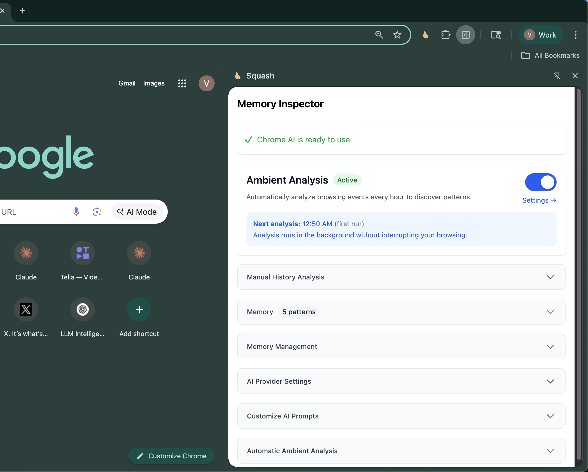
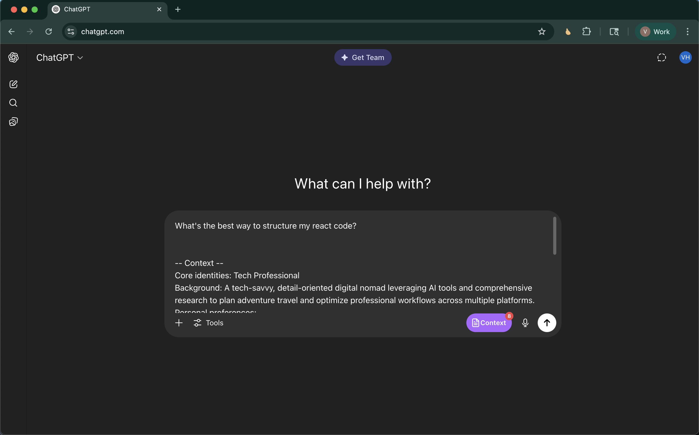
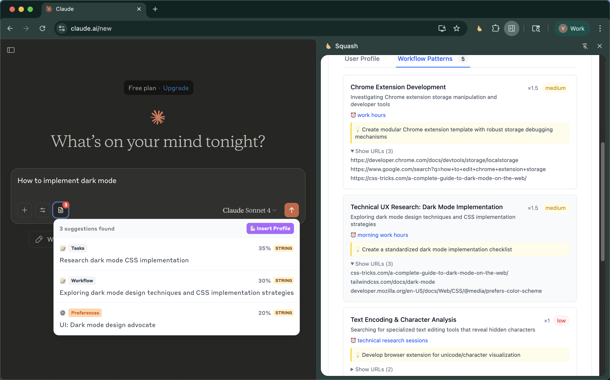

# Squash - Browser Memory Layer for AI

Squash adds an invisible memory layer to your browser, compressing every click into portable context for any AI agent.

<a href="https://chromewebstore.google.com/detail/squash-browser-memory-for/cbemgpconhoibnbbgjbeengcojcoeimh">
  Now available in the Chrome Web Store
</a>

## What it does

Squash studies your browsing patterns, learns how you work, and automatically provides relevant context when you use AI tools like ChatGPT or Claude. No more re-explaining yourself to every new AI conversation.

<p align="center">
  
</p>

## Quick Start

1. Clone and build:
   ```bash
   git clone https://github.com/kstonekuan/squash-browser-memory.git
   cd squash-browser-memory
   pnpm install
   pnpm build
   ```

2. Install in Chrome:
   - Open `chrome://extensions/`
   - Enable "Developer mode"
   - Click "Load unpacked" → select the `dist` folder

3. Choose your AI provider (in extension settings):
   - **Chrome AI (Local)**: Private, on-device analysis
   - **OpenAI-compatible APIs** (Recommended): Use local LLMs via Ollama, LM Studio, vLLM, or TGI
   - **Claude API**: Remote, requires API key
   - **Gemini API**: Remote, requires API key

## Key Features

- **Ambient Analysis**: Runs in the background, building understanding over time
- **Smart Memory**: Learns and refines patterns across sessions
- **Privacy First**: Local analysis by default, explicit consent for remote services
- **Context Injection**: Adds a "Context" button to ChatGPT and Claude that inserts relevant info from your browsing history

## AI Provider Setup

### Recommended: Local LLMs via OpenAI-compatible APIs
We strongly recommend using local LLMs for privacy and cost-effectiveness:
- **[Ollama](https://ollama.ai/)**: Easy local model deployment (e.g., `ollama run llama3.2`)
- **[LM Studio](https://lmstudio.ai/)**: User-friendly GUI for local models
- **[vLLM](https://github.com/vllm-project/vllm)**: High-performance inference server
- **[TGI](https://github.com/huggingface/text-generation-inference)**: Production-ready inference

To use: Set the custom base URL in OpenAI provider settings (e.g., `http://localhost:11434/v1` for Ollama)

### Chrome AI (100% Local)
- Chrome 138+ required
- Enable in `chrome://flags` → "Prompt API for Gemini Nano"
- Update in `chrome://components` → "Optimization Guide On Device Model" [(~4GB download)](https://github.com/kstonekuan/simple-chromium-ai/pull/6)

### Claude API (Remote)
- Get API key from [Anthropic Console](https://console.anthropic.com/)
- Enter in extension's Advanced Settings

### Gemini API (Remote)
- Get API key from [Google AI Studio](https://aistudio.google.com/apikey)
- Enter in extension's Advanced Settings

### OpenAI API (Local or Remote)
- Run a local model or get API key from [OpenAI Platform](https://platform.openai.com/api-keys)
- Enter in extension's Advanced Settings
- Supports custom endpoints for Azure OpenAI or other OpenAI-compatible services

## Usage

1. **Ambient Mode**: Enable in Advanced Settings for automatic hourly analysis
2. **Manual Analysis**: Click "Analyze History" in the side panel
3. **Context Injection**: Type in ChatGPT/Claude → click "Context" → select relevant suggestions

<p align="center">
  
  
  
</p>

## Planned Features

- **MCP Server Integration**: Expose your browsing patterns and profile as an MCP (Model Context Protocol) server for other AI tools
- **More AI Providers**: Support for additional LLM providers beyond current options
- **Enhanced Context Matching**: Smarter relevance algorithms for context suggestions
- **Workflow Automation**: Detect and suggest automation for repetitive tasks

## For Developers

### Building the Extension

```bash
pnpm dev     # Development with hot reload
pnpm build   # Build extension
pnpm check   # Run all quality checks
pnpm test    # Run tests
```

See [ARCHITECTURE.md](./ARCHITECTURE.md) for technical details.

### Squash SDK

Want to integrate browsing context into your web application? The Squash SDK allows developers to build context-aware applications that can request and use browsing insights with user permission.

```javascript
import squash from 'squash-sdk';

// Initialize and request permission
await squash.init({ appName: 'My App' });

// Get user context
const context = await squash.getContext();
```

**[📚 View SDK Documentation →](./sdk/squash-sdk/)**

Available on npm: `npm install squash-sdk`

## Privacy

- Local mode: Your data never leaves your device
- Remote mode: Data sent to API provider (requires explicit setup)
- All data stored locally in Chrome storage

## Resources

- [Simple Chromium AI](https://github.com/kstonekuan/simple-chromium-ai) - Our open source library for Chrome's built-in AI capabilities
- [Mem0 Chrome Extension](https://github.com/mem0ai/mem0-chrome-extension/) - Inspiration for context injection UX
- [Chrome AI Prompt API](https://developer.chrome.com/docs/ai/prompt-api) - Official documentation for Chrome's built-in AI
- [Anthropic TypeScript SDK](https://docs.anthropic.com/en/api/client-sdks#typescript) - Official SDK for Claude API integration
- [Gemini SDK](https://googleapis.github.io/js-genai/release_docs/index.html) - Official SDK for Gemini API integration